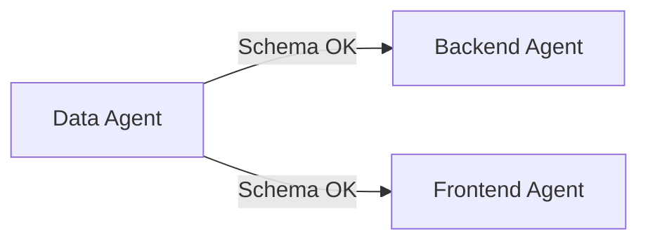
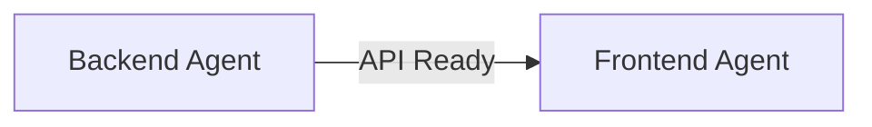
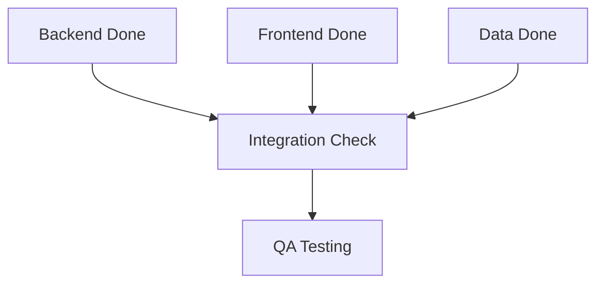

# Parallel Agent Workflow Guide

> **Purpose:** Guide for running multiple specialized agents in parallel on synchronized tasks
> **Last Updated:** 2026-02-25
> **⚠️ IMPORTANT: CPU/RAM Limits Apply - Max 2-3 agents at once**

---

## Overview

This guide shows how to use the **Task tool** to launch multiple specialized agents that work in parallel on different parts of the same feature.

## ⚠️ CRITICAL: System Resource Limits

### CPU/RAM Constraints

| Rule | Limit | Reason |
|------|-------|--------|
| **Max concurrent agents** | **2-3** | CPU/RAM overload causes system freeze |
| **Heavy tasks** | **1 at a time** | API Migration, UX Revolution consume most resources |
| **Monitor before launch** | Check system load | Use `/tasks` to see running agents |

### Agent Resource Weight

| Weight | Agents | Notes |
|--------|--------|-------|
| **HEAVY** 🟥 | API Migration, UX Revolution, Type Safety | Consume 30-40% CPU each |
| **MEDIUM** 🟨 | Design Integration, Portal Layout, Component Building | Consume 15-20% CPU each |
| **LIGHT** 🟩 | Documentation, QA, Testing, Bug Fixes | Consume 5-10% CPU each |

### Example Configurations

```
✅ SAFE - 2 agents (total ~25% CPU)
- Security Lead (HEAVY - critical)
- Documentation (LIGHT)

✅ SAFE - 3 agents (total ~35% CPU)
- Security Lead (HEAVY - critical)
- Documentation (LIGHT)
- QA Testing (LIGHT)

❌ UNSAFE - 8 agents (total ~200% CPU - OVERLOAD)
- API Migration (HEAVY)
- UX Revolution (HEAVY)
- Type Safety (HEAVY)
- Design Integration (MEDIUM)
- Portal Layout (MEDIUM)
- + 3 more...
```

### When to Stop Agents

**Stop immediately if:**
- User reports CPU/RAM at limit
- System becomes sluggish
- More than 3 agents running

**Stop in this order:**
1. HEAVY agents (API Migration, UX Revolution, Type Safety)
2. MEDIUM agents (Design Integration, Portal Layout)
3. Keep: Security fixes, Critical bugs

---

---

## The "Vibe Coding" Multi-Agent Approach

### What is Vibe Coding?

Vibe Coding with multiple agents means:
1. **You (the human)** provide the high-level vision
2. **Project Manager agent** breaks down the work
3. **Specialist agents** work in parallel on their domains
4. **All agents synchronize** through shared documentation

---

## Step-by-Step: Launching Parallel Agents

### Phase 1: Define the Work

First, clearly define what needs to be done:

```markdown
## Feature: Global Subject Management

### Goal: Enable Platform Admin to create global subject templates

### Work Breakdown:
1. **Backend:** Create API routes for CRUD operations
2. **Frontend:** Build admin page with subject list and forms
3. **Database:** Verify schema has all needed fields
```

### Phase 2: Launch Parallel Agents

Use the **Task tool** with `run_in_background: true` for parallel execution:

#### Agent 1: Backend Lead (API Routes)

```typescript
Task({
  subagent_type: "general-purpose",
  prompt: `You are the Backend Lead specialist.

TASK: Create API routes for Global Subject Management

CONTEXT:
- Platform Admin needs to create/edit/delete global subject templates
- Global subjects have schoolId = NULL (unlike school-specific subjects)
- Use the createApiRoute wrapper from src/lib/api/route-handler.ts

FILES TO CREATE:
1. src/app/api/admin/subjects/route.ts
   - GET: List all global subjects (schoolId IS NULL)
   - POST: Create new global subject

2. src/app/api/admin/subjects/[id]/route.ts
   - GET: Get single subject
   - PATCH: Update subject
   - DELETE: Delete subject

PATTERNS TO FOLLOW:
- Use createApiRoute wrapper
- Allowed roles: ['admin']
- Use successResponse, errorResponse, notFoundResponse
- Reference: src/app/api/schools/route.ts for similar patterns

When done, report back with:
- Files created
- Any issues encountered`,
  run_in_background: true
})
```

#### Agent 2: Frontend Lead (UI Page)

```typescript
Task({
  subagent_type: "general-purpose",
  prompt: `You are the Frontend Lead specialist.

TASK: Create Global Subject Management page for Platform Admin

CONTEXT:
- Platform Admin needs to manage global subject templates
- Page should list subjects with add/edit/delete actions
- Use existing admin page patterns

FILES TO CREATE:
1. src/app/admin/subjects/page.tsx
   - Table listing all global subjects
   - "Add Subject" button
   - Edit/Delete actions per row
   - Loading and empty states

2. Create modals:
   - src/components/admin/add-subject-modal.tsx
   - src/components/admin/edit-subject-modal.tsx

PATTERNS TO FOLLOW:
- Reference: src/app/admin/schools/page.tsx for similar table layout
- Use shadcn/ui components (Table, Button, Dialog)
- Portal color: Pink gradient rgb(236 72 153) → rgb(219 39 119)
- API endpoint: /api/admin/subjects (being created in parallel)

When done, report back with:
- Files created
- Any issues with API integration`,
  run_in_background: true
})
```

#### Agent 3: Data Lead (Schema Verification)

```typescript
Task({
  subagent_type: "general-purpose",
  prompt: `You are the Data Lead specialist.

TASK: Verify database schema supports Global Subject Management

CONTEXT:
- Platform Admin needs to create global subject templates
- Need to verify subjects table can support this

CHECK:
1. Read src/lib/db/schema.ts
2. Find the subjects table definition
3. Verify it has:
   - id
   - name
   - code
   - schoolId (can be NULL for global subjects)
   - description
   - all fields needed for CRUD

REPORT:
- Is the schema sufficient?
- Any fields missing?
- Recommended changes if needed`,
  run_in_background: true
})
```

---

## Monitoring Parallel Work

### Check Agent Status

After launching agents, check their progress:

```javascript
// Use TaskOutput to check each agent
const agentResults = await Promise.all([
  checkAgent('agent-1-id'),
  checkAgent('agent-2-id'),
  checkAgent('agent-3-id')
])
```

### In the Claude Code Interface

1. Look for background task notifications
2. Each agent will report back when done
3. Review all results before proceeding

---

## Synchronization Points

### Point 1: Schema Verification First



**Data Lead goes first** - verifies schema before others start.

### Point 2: Backend Before Frontend Integration



**Backend must complete** before Frontend can fully integrate.

### Point 3: Final Integration



**All agents report back** - then do final integration test.

---

## Example Session: Full Workflow

```markdown
### User Request:
"Implement Global Subject Management for Platform Admin"

### Step 1: Launch Data Lead (First - blocks others)
→ Task: Verify schema has subjects table with all fields

### Step 2: After Data Lead reports "Schema OK", launch in parallel:
→ Backend Lead: Create /api/admin/subjects routes
→ Frontend Lead: Create /admin/subjects page

### Step 3: Wait for both to complete
→ Backend reports: "3 files created"
→ Frontend reports: "3 files created, needs API testing"

### Step 4: Integration Test
→ QA Specialist: Test full flow end-to-end

### Step 5: Documentation
→ Documentation Specialist: Update CHANGELOG.md
```

---

## Task Templates

### Backend Lead Task Template

```typescript
Task({
  subagent_type: "general-purpose",
  prompt: `You are the Backend Lead specialist.

ROLE: API development, business logic, authentication

TASK: [Describe the API work needed]

CONTEXT:
- [Any relevant context]
- [Dependencies completed]

FILES TO CREATE/MODIFY:
- [List files]

PATTERNS:
- Use createApiRoute wrapper
- Reference: [Similar working file]
- Allowed roles: [List roles]

REPORT BACK WITH:
- Files created/modified
- API endpoints added
- Any issues`,
  run_in_background: true
})
```

### Frontend Lead Task Template

```typescript
Task({
  subagent_type: "general-purpose",
  prompt: `You are the Frontend Lead specialist.

ROLE: React components, UI/UX, state management

TASK: [Describe the UI work needed]

CONTEXT:
- [Any relevant context]
- [API endpoints available]

FILES TO CREATE/MODIFY:
- [List files]

PATTERNS:
- Reference: [Similar working page]
- Portal color: [Gradient]
- Components: [shadcn/ui components needed]

REPORT BACK WITH:
- Files created/modified
- UI flow description
- Any issues with API integration`,
  run_in_background: true
})
```

### Data Lead Task Template

```typescript
Task({
  subagent_type: "general-purpose",
  prompt: `You are the Data Lead specialist.

ROLE: Database queries, schema, optimization

TASK: [Describe the database work needed]

CONTEXT:
- [Any relevant context]

REQUIRED READING:
- docs/memory/database-patterns.md
- src/lib/db/schema.ts

REPORT BACK WITH:
- Schema analysis
- Query patterns used
- Any performance considerations`,
  run_in_background: true
})
```

---

## Common Workflows

### Workflow 1: New Feature (Full Stack)

```
1. Data Lead → Verify schema (5 min)
   ↓
2. Parallel:
   - Backend Lead → Create API (15 min)
   - Frontend Lead → Create UI (20 min)
   ↓
3. QA Specialist → Test flow (10 min)
   ↓
4. Documentation → Update docs (5 min)

Total: ~45 min (vs 60+ min sequential)
```

### Workflow 2: Bug Fix

```
1. Debug Specialist → Diagnose issue (5 min)
   ↓
2. Domain Specialist → Implement fix (10 min)
   ↓
3. QA Specialist → Verify fix (5 min)

Total: ~20 min
```

### Workflow 3: Code Migration

```
Parallel (can run simultaneously):
- Backend Agent → Migrate API routes
- Data Agent → Optimize queries
- Frontend Agent → Update components

Total: Depends on largest task
```

---

## Best Practices

1. **Start with Data Lead** for database-dependent work
2. **Launch in parallel** when work is independent
3. **Use run_in_background: true** for non-blocking work
4. **Check results** before next phase
5. **Document everything** in CHANGELOG.md

---

## Quick Commands

### Launch Single Agent
```typescript
Task({ subagent_type: "general-purpose", prompt: "..." })
```

### Launch Parallel Agents
```typescript
// All in one message - Claude runs them in parallel
Task({ subagent_type: "...", prompt: "...", run_in_background: true })
Task({ subagent_type: "...", prompt: "...", run_in_background: true })
Task({ subagent_type: "...", prompt: "...", run_in_background: true })
```

### Check Background Agent
```typescript
TaskOutput({ task_id: "agent-id", block: false })
```

---

**Remember:** The key to vibe coding is clear vision + specialized agents + synchronization points!
