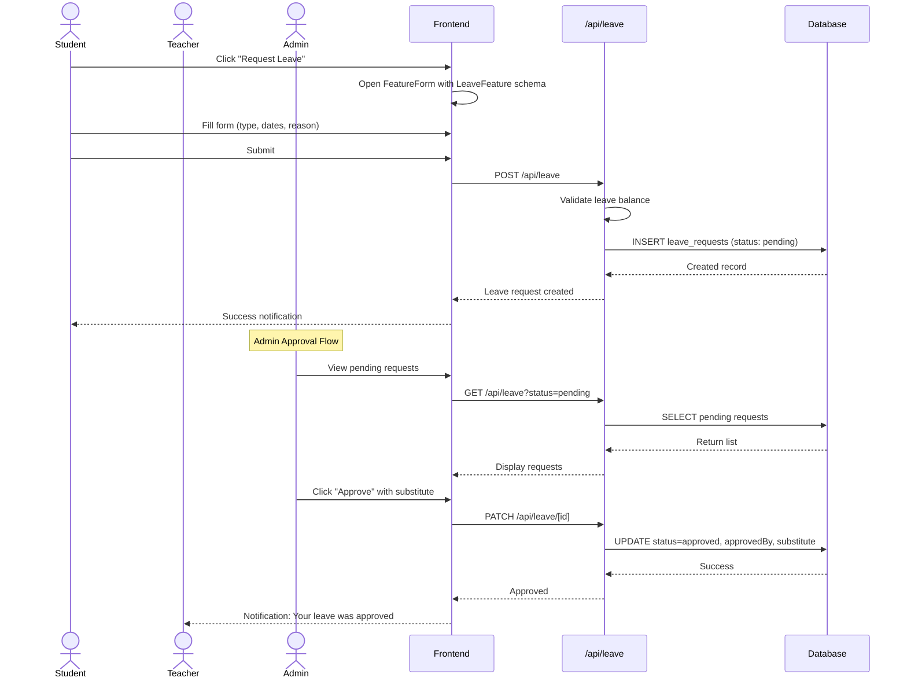
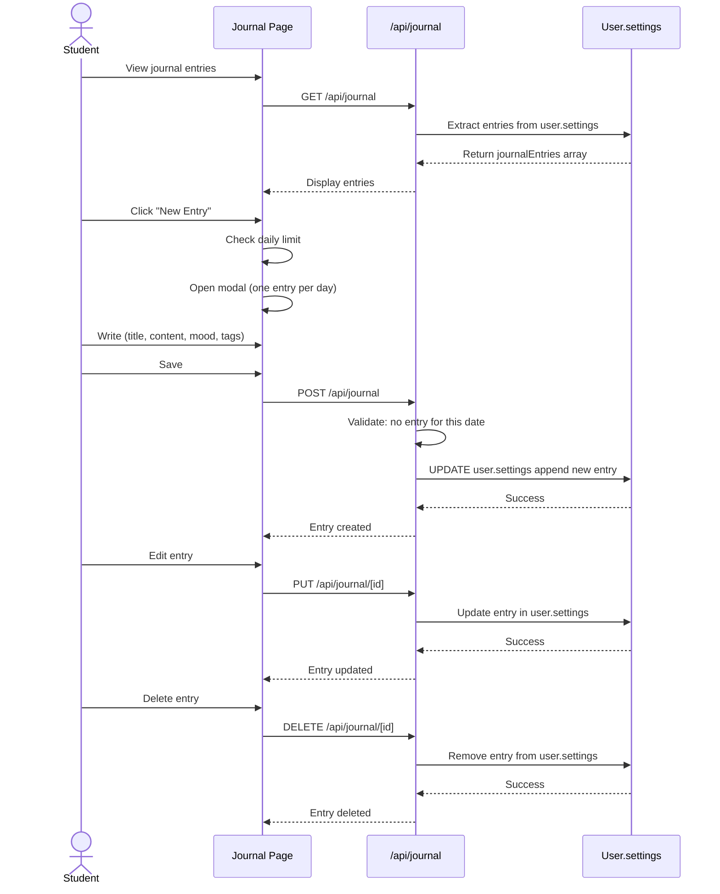
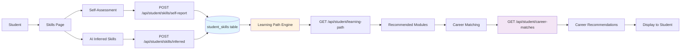
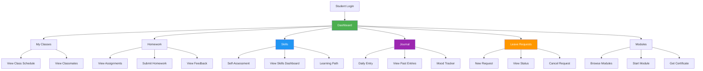
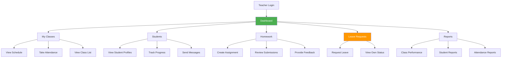
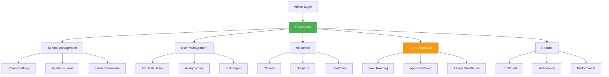

# Bhutan EduSkill - Workflow System Architecture

> **Last Updated:** March 5, 2026
> **Version:** 3.0.0
> **Status:** Unified API Migration Complete

## Table of Contents

1. [System Overview](#system-overview)
2. [Unified API Architecture](#unified-api-architecture)
3. [Feature Workflow Diagrams](#feature-workflow-diagrams)
4. [New API Routes (v3.0)](#new-api-routes-v30)
5. [Data Flow Patterns](#data-flow-patterns)
6. [Portal-Specific Workflows](#portal-specific-workflows)

---

## System Overview

```
┌─────────────────────────────────────────────────────────────────────────────┐
│                        BHUTAN EDUSKILL PLATFORM                              │
├─────────────────────────────────────────────────────────────────────────────┤
│                                                                              │
│  ┌─────────────┐  ┌─────────────┐  ┌─────────────┐  ┌─────────────┐         │
│  │   Student   │  │   Teacher   │  │School Admin │  │  Platform   │         │
│  │   Portal    │  │   Portal    │  │   Portal    │  │    Admin    │         │
│  └──────┬──────┘  └──────┬──────┘  └──────┬──────┘  └──────┬──────┘         │
│         │                │                │                │                  │
│         └────────────────┼────────────────┼────────────────┘                  │
│                          │                │                                    │
│                   ┌──────▼────────────────▼──────┐                            │
│                   │    UNIFIED API LAYER         │                            │
│                   │  /api/resources/[resource]/   │                            │
│                   └──────┬────────────────┬──────┘                            │
│                          │                │                                    │
│                   ┌──────▼────────────────▼──────┐                            │
│                   │     FEATURE SYSTEM           │                            │
│                   │    (defineFeature)           │                            │
│                   └──────┬────────────────┬──────┘                            │
│                          │                │                                    │
│                   ┌──────▼────────────────▼──────┐                            │
│                   │   DATABASE LAYER (Neon)      │                            │
│                   │   - 145+ Tables              │                            │
│                   │   - Drizzle ORM              │                            │
│                   └──────────────────────────────┘                            │
│                                                                              │
└─────────────────────────────────────────────────────────────────────────────┘
```

---

## Unified API Architecture

### API Route Consolidation

```
BEFORE: 340+ individual route files
AFTER:  103 unified resource routes

Pattern: /api/resources/{resource}/
         ├── /route.ts           (GET, POST - List & Create)
         ├── /actions/route.ts   (POST - Custom actions)
         ├── /public/route.ts    (GET - Public endpoints)
         └── /webhooks/route.ts  (POST - External webhooks)
```

### Unified Route Structure

```mermaid
graph TD
    A[Client Request] --> B{Route Type}

    B -->|List/Create| C[/api/resources/[resource]/route.ts]
    B -->|Custom Action| D[/api/resources/[resource]/actions/route.ts]
    B -->|Public Data| E[/api/resources/[resource]/public/route.ts]
    B -->|Webhook| F[/api/resources/[resource]/webhooks/route.ts]

    C --> G[Unified CRUD Handler]
    D --> H[Action Router]
    E --> I[Public Handler]
    F --> J[Webhook Handler]

    G --> K[Feature Definition]
    H --> K
    I --> K
    J --> K

    K --> L[Database Operations]
    L --> M[Response]
```

---

## Feature Workflow Diagrams

### 1. Leave Management Workflow



### Leave Feature Definition

```typescript
// src/features/leave.feature.ts
export const LeaveFeature = defineFeature({
  name: "leave-requests",
  tableName: "leave_requests",

  schema: {
    id: { type: "text", required: true },
    type: { type: "select", options: ["sick", "vacation", "emergency", "family", "casual", "official", "other"] },
    status: { type: "select", options: ["pending", "approved", "rejected", "cancelled"] },
    startDate: { type: "date", required: true },
    endDate: { type: "date", required: true },
    reason: { type: "textarea", required: true },
    applicantId: { type: "text", required: true },
    applicantType: { type: "select", options: ["student", "teacher"] },
    approvedBy: { type: "text" },
    approvedAt: { type: "datetime" },
    rejectionReason: { type: "textarea" },
    substituteTeacherId: { type: "text" },
    leaveHandoverNotes: { type: "textarea" },
  },

  actions: {
    approve: { method: "POST" },
    reject: { method: "POST" },
    cancel: { method: "POST" },
    getBalance: { method: "GET" },
  },

  permissions: {
    create: ["student", "teacher"],
    approve: ["admin", "school-admin"],
    cancel: ["student", "teacher", "admin", "school-admin"],
  },
});
```

### 2. Student Journal Workflow



### 3. Student Skills & Career Workflow



---

## New API Routes (v3.0)

### Leave Management APIs

| Route | Method | Description | Status |
|-------|--------|-------------|--------|
| `/api/leave` | GET | List leave requests (filtered by user) | ✅ |
| `/api/leave` | POST | Create new leave request | ✅ |
| `/api/leave/[id]` | PATCH | Approve/reject/cancel request | ✅ |
| `/api/leave/[id]` | DELETE | Delete request (pending/rejected only) | ✅ |

### Student Journal APIs

| Route | Method | Description | Status |
|-------|--------|-------------|--------|
| `/api/journal` | GET | Get user's journal entries | ✅ |
| `/api/journal` | POST | Create new journal entry | ✅ |
| `/api/journal/[id]` | GET | Get single entry | ✅ |
| `/api/journal/[id]` | PUT | Update entry | ✅ |
| `/api/journal/[id]` | DELETE | Delete entry | ✅ |

### Student Skills APIs

| Route | Method | Description | Status |
|-------|--------|-------------|--------|
| `/api/student/skills/self-report` | POST | Add self-reported skill | ✅ |
| `/api/student/skills/inferred` | POST | Add AI-inferred skill | ✅ |
| `/api/student/learning-path` | GET | Get personalized learning path | ✅ |
| `/api/student/career-matches` | GET | Get career recommendations | ✅ |

### Student Modules APIs

| Route | Method | Description | Status |
|-------|--------|-------------|--------|
| `/api/student/modules` | GET | List available modules | ✅ |
| `/api/student/modules/[id]` | GET | Get module details | ✅ |
| `/api/student/modules/[id]/progress` | POST | Update module progress | ✅ |
| `/api/student/modules/[id]/complete` | POST | Mark module complete | ✅ |
| `/api/student/modules/[id]/certificate` | GET | Generate certificate | ✅ |
| `/api/student/modules/recommendations` | GET | Get module recommendations | ✅ |

### Homework Feedback APIs

| Route | Method | Description | Status |
|-------|--------|-------------|--------|
| `/api/student/homework/[id]/feedback` | GET | Get homework feedback | ✅ |

### Transport Tracking APIs

| Route | Method | Description | Status |
|-------|--------|-------------|--------|
| `/api/transport/tracking/[vehicleId]` | GET | Get real-time vehicle tracking | ✅ |

### ID Card APIs

| Route | Method | Description | Status |
|-------|--------|-------------|--------|
| `/api/id-card/generate` | POST | Generate student ID card | ✅ |

**Total New APIs Created: 19**

---

## Data Flow Patterns

### Pattern 1: Unified CRUD Flow

```
┌─────────────────────────────────────────────────────────────────┐
│                    UNIFIED CRUD PATTERN                         │
├─────────────────────────────────────────────────────────────────┤
│                                                                 │
│  1. Frontend:                                                   │
│     const { data } = await apiClient.resources.users.list()     │
│                                                                 │
│  2. API Handler (src/app/api/resources/[resource]/route.ts):    │
│     - Calls FeatureDefinition.handlers.list()                   │
│     - Applies permissions                                       │
│     - Returns formatted response                                │
│                                                                 │
│  3. Feature System (defineFeature):                             │
│     - Validates query parameters                                │
│     - Calls db.query with proper relations                      │
│     - Optimizes queries (N+1 prevention)                        │
│                                                                 │
│  4. Database:                                                   │
│     - Executes optimized query                                  │
│     - Returns typed results                                     │
│                                                                 │
└─────────────────────────────────────────────────────────────────┘
```

### Pattern 2: Action Handler Flow

```
┌─────────────────────────────────────────────────────────────────┐
│                  CUSTOM ACTION PATTERN                          │
├─────────────────────────────────────────────────────────────────┤
│                                                                 │
│  1. Frontend:                                                   │
│     await apiClient.resources.leave.actions.approve({           │
│       id: leaveId,                                              │
│       substituteTeacherId: teacherId                            │
│     })                                                          │
│                                                                 │
│  2. API Handler (/api/resources/[resource]/actions/route.ts):   │
│     - Routes to specific action handler                         │
│     - Validates action parameters                               │
│     - Executes custom business logic                            │
│                                                                 │
│  3. Action Handler:                                             │
│     - Performs domain-specific operations                       │
│     - Updates multiple tables if needed                         │
│     - Triggers notifications                                    │
│                                                                 │
│  4. Response:                                                   │
│     - Returns action result                                     │
│     - Includes side effects (notifications, emails)             │
│                                                                 │
└─────────────────────────────────────────────────────────────────┘
```

### Pattern 3: JSONB Field Pattern (Journal)

```
┌─────────────────────────────────────────────────────────────────┐
│                    JSONB STORAGE PATTERN                        │
├─────────────────────────────────────────────────────────────────┤
│                                                                 │
│  Table: users                                                   │
│  Column: settings (JSONB)                                       │
│                                                                 │
│  Structure:                                                     │
│  {                                                              │
│    "journalEntries": [                                          │
│      { "id": "uuid", "date": "2026-03-05", ... }                │
│    ]                                                            │
│  }                                                              │
│                                                                 │
│  Flow:                                                          │
│  1. GET: Extract and filter from JSONB                          │
│  2. POST: Parse JSON, append new entry, update                  │
│  3. PUT: Find and update specific entry                        │
│  4. DELETE: Filter out specific entry, update                   │
│                                                                 │
│  Benefits:                                                      │
│  - No separate table needed                                     │
│  - User-scoped data isolation                                   │
│  - Flexible schema evolution                                    │
│                                                                 │
└─────────────────────────────────────────────────────────────────┘
```

---

## Portal-Specific Workflows

### Student Portal Workflow



### Teacher Portal Workflow



### School Admin Workflow



---

## Technical Implementation Details

### Next.js 15 Async Params Pattern

```typescript
// ✅ CORRECT - Next.js 15 pattern
interface RouteContext {
  params: Promise<{ id: string }>;
}

export const GET = createApiRoute<{ id: string }>(
  async (request: NextRequest, auth, context: RouteContext) => {
    const { id } = await context.params;  // Must await params
    // ... handler logic
  },
  ['student', 'teacher']
);

// ❌ WRONG - Old pattern
export const GET = createApiRoute(
  async (request: NextRequest, auth, context: RouteContext) => {
    const { id } = context.params;  // Error: params is a Promise
    // ... handler logic
  }
);
```

### Server-Only Import Fix

```typescript
// ✅ CORRECT - Dynamic import to avoid server-only in client components
// src/lib/api/route-handler.ts
export const createApiRoute = <TContext = {}>(...) => {
  return async (request: NextRequest, ...args: unknown[]) => {
    // Dynamic import inside the handler
    const { requireAuth } = await import("@/lib/auth-utils");
    const auth = await requireAuth(request);
    // ... rest of handler
  };
};

// ❌ WRONG - Top-level import breaks client components
import { requireAuth } from "@/lib/auth-utils";  // server-only
export const createApiRoute = ...  // Used in client components
```

### Type-Safe Feature Definitions

```typescript
// ✅ CORRECT - Schema separation
export const defineFeature = (config) => {
  return {
    name: config.name,
    schema: config.schema,      // For UI/Forms (SchemaDefinition)
    dbSchema: schema,           // For DB operations (Drizzle schema)
    // ...
  };
};

// ✅ Export both types
export type { SchemaDefinition, ColumnDefinition } from "./define-feature";
```

---

## Appendix: Feature Index

### All Defined Features

| Feature | Table | Primary Actions | Portals |
|---------|-------|-----------------|---------|
| users | users | create, update, delete, getRole | All |
| students | students | create, update, delete, promote | Admin, Teacher, School Admin |
| teachers | teachers | create, update, delete | Admin, School Admin |
| classes | classes | create, update, delete, enroll | School Admin, Teacher |
| subjects | subjects | create, update, delete | School Admin |
| schools | schools | create, update, delete, getStats | Platform Admin |
| leave-requests | leave_requests | approve, reject, cancel, getBalance | Student, Teacher, Admin |
| journal | N/A (JSONB) | create, update, delete | Student |
| assessments | assessments | create, publish, grade | Teacher, Admin |
| grades | grades | submit, approve | Teacher, Student |
| appointments | appointments | book, cancel, confirm | Student, Counselor |
| payments | payments | pay, refund | Admin |
| billing | billing | generate, send | Admin |

### Feature Files Location

```
src/features/
├── index.ts                    # Feature registry and exports
├── users.feature.tsx           # User management
├── students.feature.ts         # Student operations
├── teachers.feature.ts         # Teacher operations
├── schools.feature.tsx         # School operations
├── classes.feature.ts          # Class operations
├── subjects.feature.ts         # Subject operations
├── leave.feature.ts            # Leave requests ✨ NEW
├── journal.feature.ts          # Student journal ✨ NEW
├── assessments.feature.ts      # Assessments
├── grades.feature.ts           # Grades
├── appointments.feature.ts     # Appointments
├── subscriptions.feature.tsx   # Subscription management
├── timetable-slots.feature.ts  # Timetable slots
├── submissions.feature.ts      # Homework submissions
├── rubrics.feature.ts          # Assessment rubrics
├── messages.feature.ts         # Messaging
├── roadmaps.feature.ts         # Learning roadmaps
├── skill-gaps.feature.ts       # Skill gap analysis
└── ...
```

---

## Related Documentation

- [Unified Architecture Diagram](unified-architecture.mmd)
- [Workflow Component Specs](../workflow/workflow-component-specs.md)
- [Development Framework](../DEVELOPMENT_FRAMEWORK.md)
- [API Documentation](../api/README.md)
- [Database Schema](../database/schema.md)

---

**Document Version:** 3.0.0
**Last Updated:** 2026-03-05
**Maintained By:** Development Team